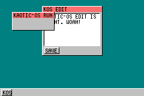



## False GUI and Console

### Description

This was the code that I was using to make an "OS" in VB, but i have moved it to QBasic and C++ now, so this code is a little old. There is a bug in it, where it slows down and eats all the CPU up, I dont know where tho.
 
### More Info
 

             |
---                |---
**Submitted On**   |2004-11-22 13:25:42
**By**             |[Llama Boy](https://github.com/Planet-Source-Code/PSCIndex/blob/master/ByAuthor/llama-boy.md)
**Level**          |Advanced
**User Rating**    |5.0 (10 globes from 2 users)
**Compatibility**  |VB 6\.0
**Category**       |[Graphics](https://github.com/Planet-Source-Code/PSCIndex/blob/master/ByCategory/graphics__1-46.md)
**World**          |[Visual Basic](https://github.com/Planet-Source-Code/PSCIndex/blob/master/ByWorld/visual-basic.md)
**Archive File**   |[False\_GUI\_1825401242004\.zip](https://github.com/Planet-Source-Code/llama-boy-false-gui-and-console__1-57551/archive/master.zip)

